# PathFinder Job Recommender 🔍💼

PathFinder is a personalized job recommendation web app built with Django and PostgreSQL. It suggests relevant job opportunities based on user skills, preferences, and real-time data from Jooble API. Designed with a clean, mobile-responsive UI, it offers a fast and intuitive experience for users to discover suitable career paths.

## 🧰 Tech Stack

- **Backend:** Django (Python)
- **Database:** PostgreSQL
- **Frontend:** HTML and CSS
- **APIs Used:** Jooble API
- **Hosting:** Render
- **Version Control:** Git & GitHub

## ✨ Features

- Real-time job search with live listings from Jooble API
- Smart job matching based on user input and filtering
- Clean, responsive design for both desktop and mobile
- User authentication system (Register / Login / Logout)
- Contact form for inquiries and feedback
- Admin panel via Django Admin for content control

Screenshots

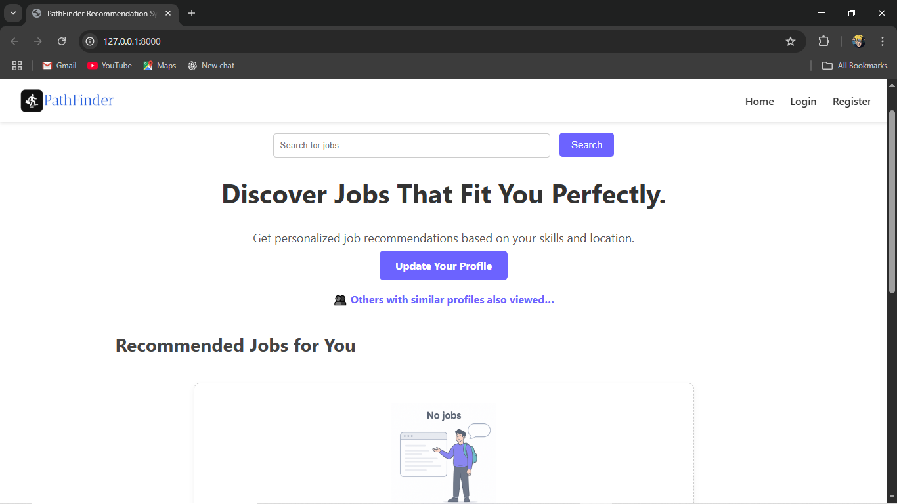  
Landing page for exploring job recommendations

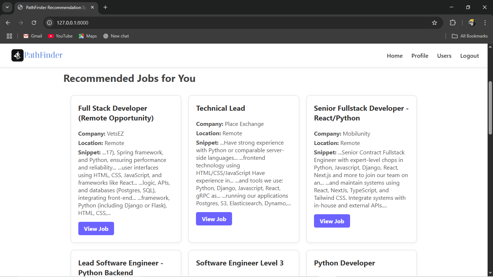  
Recommendation Page

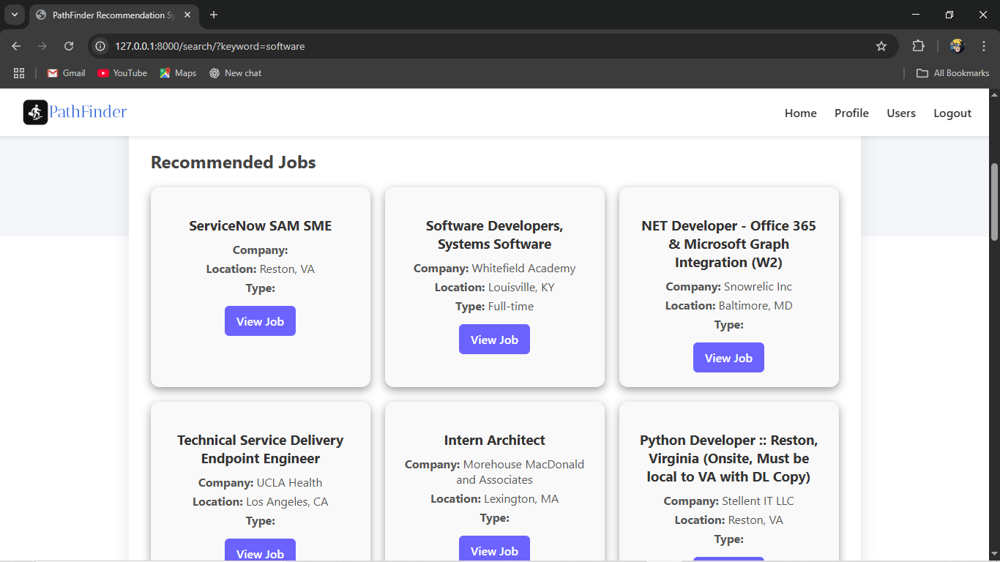  
Search Page

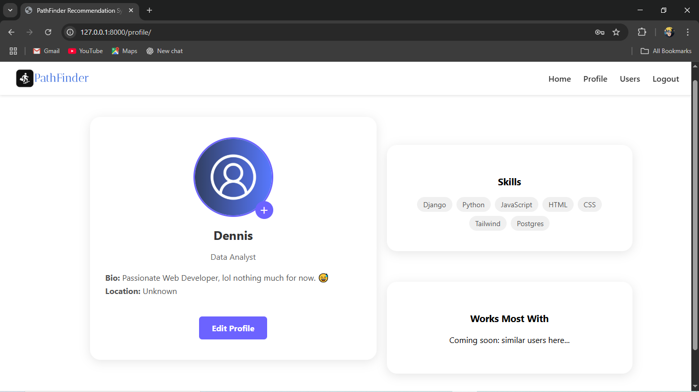  
Profile Page

  
Edit Profile Page

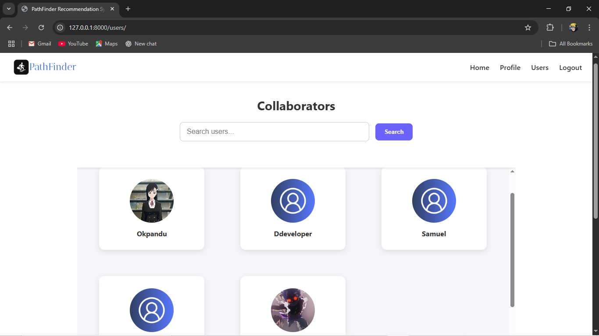  
Other users

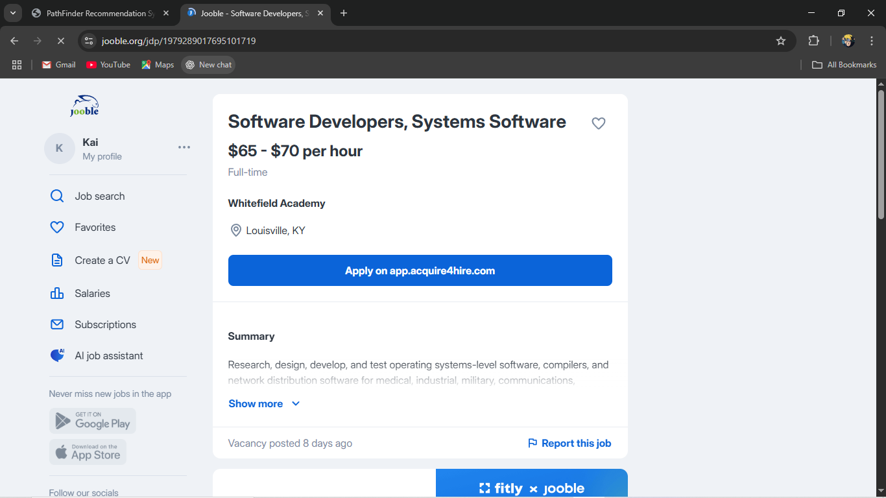  
Jobs from Jooble Platform

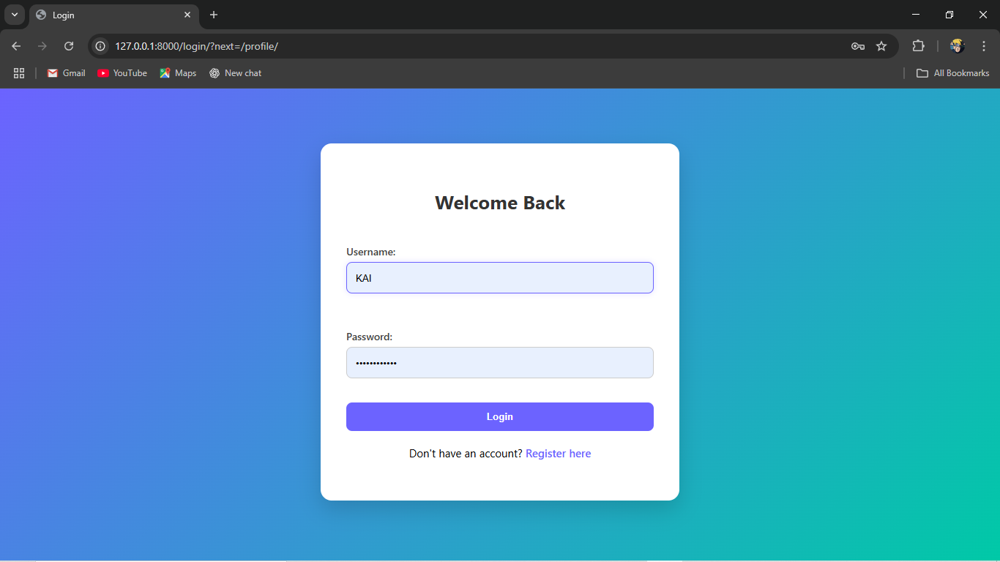  
Login Page

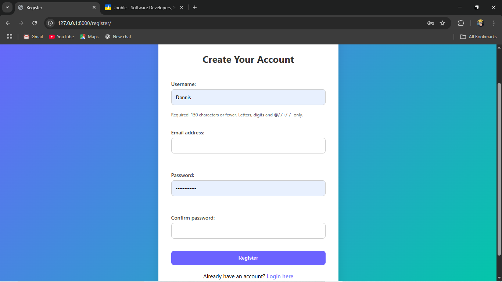  
Register Page

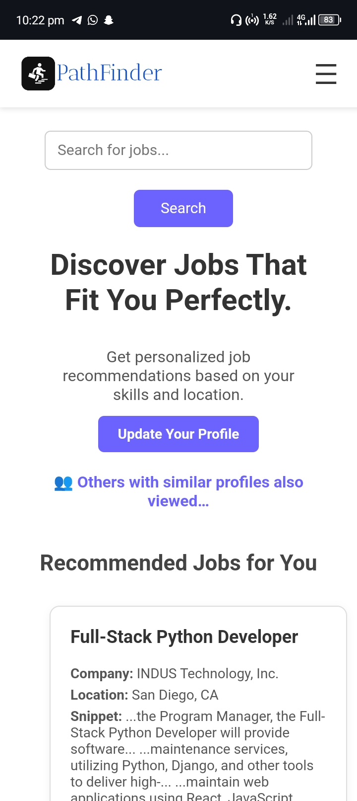  
Mobile view of home page

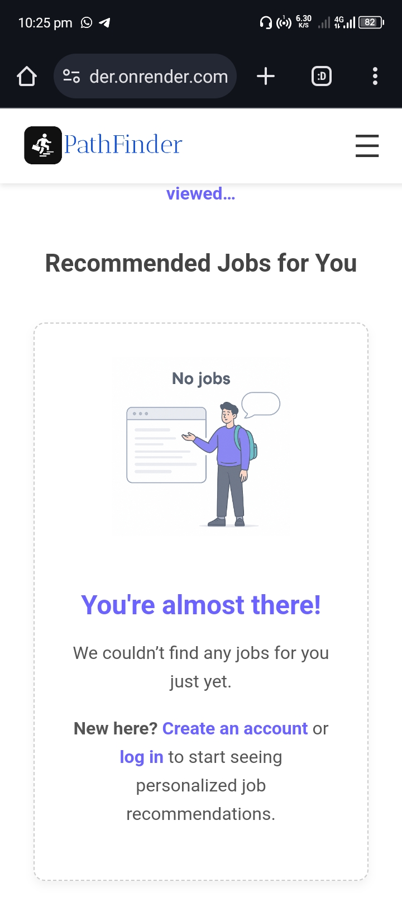  
Mobile view of home page (not logged in)

  
Mobile login

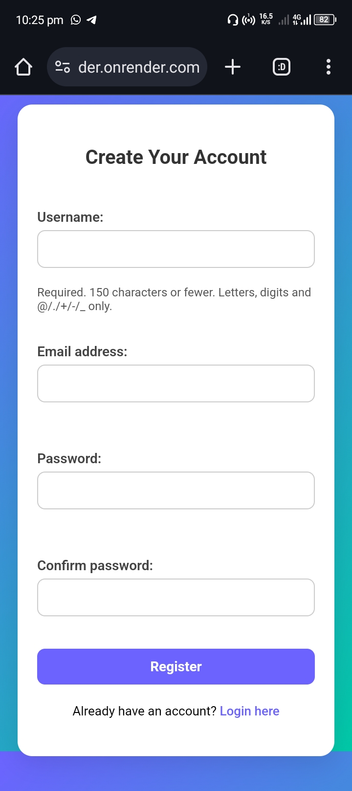  
Mobile register

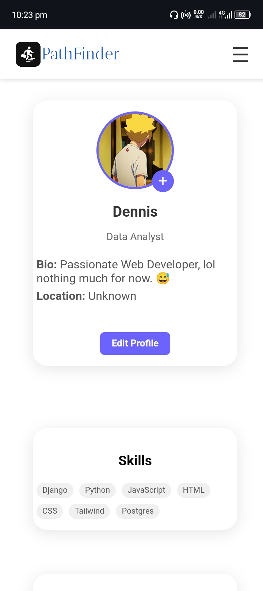  
Mobile profile

  
Mobile users

