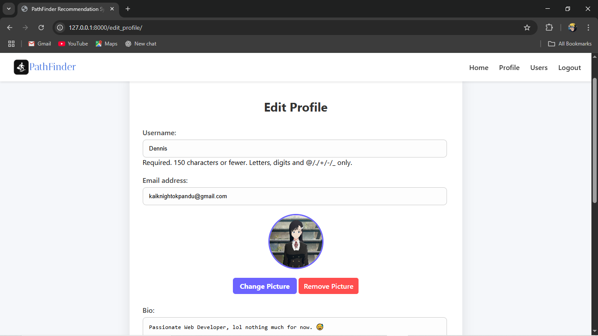
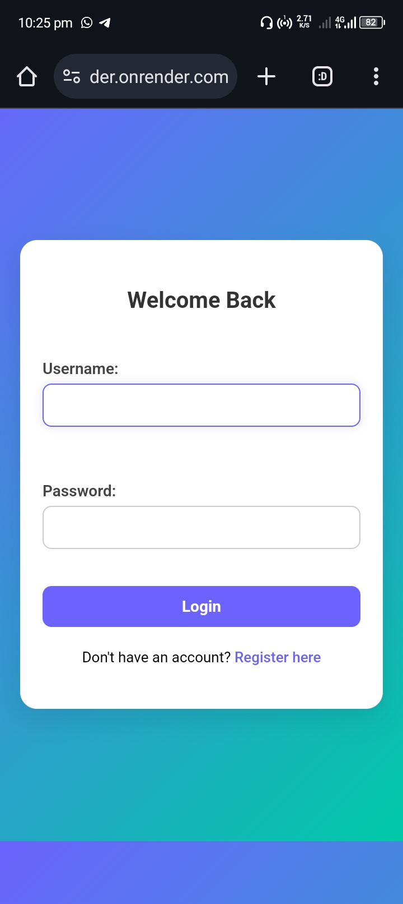

# Improved Job Recommender System- (Will Upload soon)
This project is a Django-based web application that helps users find personalized job recommendations based on their skills, location, and real-time job data fetched using the Jooble API.

Screenshots

  
Landing page for exploring job recommendations

  
Recommendation Page

  
Search Page

  
Profile Page

  
Edit Profile Page

  
Other users

  
Jobs from Jooble Platform

  
Login Page

  
Register Page

  
Mobile view of home page

  
Mobile view of home page (not logged in)

  
Mobile login

  
Mobile register

  
Mobile profile

  
Mobile users

